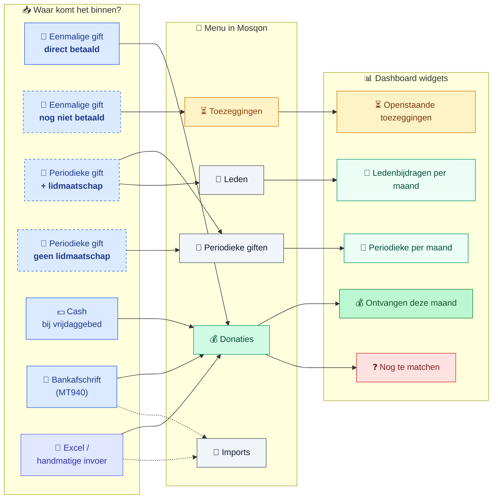
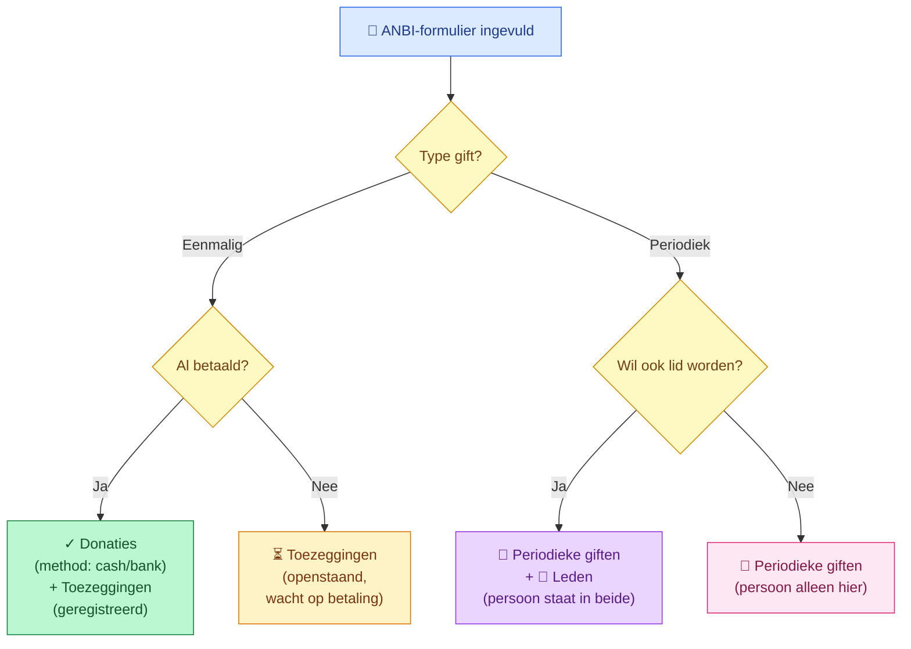

# Mosqon — bronnen, menu's en dashboard

**Doel:** in één plaatje uitleggen hoe geld en toezeggingen door Mosqon stromen, **welke menu-items van de app waar gebruikt worden**, en welke widgets op het dashboard verschijnen.

Drie kleuren doen het werk:
- 🟦 **Blauw** = invoer (formulier, cash, bank, import)
- 🟧 **Oranje** = belofte / nog niet voldaan
- 🟩 **Groen** = ontvangen geld

> **Kernregel:** een ondertekend formulier is nog geen geld. Pas als de penningmeester het bedrag op de rekening ziet (of cash heeft ontvangen) telt het mee als "ontvangen".

---

## Hoe te bekijken / exporteren

Plak de Mermaid-blokken hieronder op [mermaid.live](https://mermaid.live) → **Actions → PNG/SVG** voor een plaatje in je presentatie. Zie *Tools* onderaan voor andere opties.

---

## Diagram 1 — bronnen → menu's → dashboard

Hoofdflow: waar komt het binnen, waar zie je het terug in Mosqon, en wat verschijnt er op het dashboard.

---

## Diagram 2 — wat doet het ANBI-formulier per scenario?

Het ANBI-formulier is één publiek formulier, maar levert **vier verschillende uitkomsten** op afhankelijk van wat de schenker invult:

---

## Wat staat er in elk menu-item?

Voor de niet-technische blik: per menu-item één regel uitleg.

| Menu-item | Wat staat erin | Voorbeeld-regel in de tabel |
|---|---|---|
| **📊 Dashboard** | Samenvatting in widgets — geen lijsten | "€ 8.420 ontvangen deze maand" + "€ 12.500 openstaand" |
| **👥 Leden** | Personen met een lidmaatschap (al dan niet met maandbedrag) | Ahmed Yilmaz · €25/m · actief sinds 01-03-2026 |
| **💰 Donaties** | Alle daadwerkelijke betalingen — uit alle bronnen | 12-04 · €100 · cash · Ahmed Y. |
| **⏳ Toezeggingen** | Beloftes die nog niet voldaan zijn | Mohamed K. · €500 voor renovatie · open · gemaakt 02-04 |
| **🔁 Periodieke giften** | Lopende ANBI-akten met maandbedrag | Fatima B. · €30/m · sinds jan-2026 · lid: ja · betaald deze maand: ja |
| **📂 Imports** | Wat is er recent geüpload + wat is gematcht/niet | 01-04 · MT940-april.xml · 23 rijen · 19 gematcht · 4 onbekend |
| **⚙️ Instellingen** | Organisatie-info, gebruikersrollen | (nog niet in MVP) |

---

## Hoe de dashboard-widgets gevuld worden

| Widget | Bron-menu | Telt mee wanneer | Telt **niet** mee |
|---|---|---|---|
| **💰 Ontvangen deze maand** | Donaties | Geld is binnen (cash/bank/online) deze maand | Belofte zonder betaling |
| **⏳ Openstaande toezeggingen** | Toezeggingen | Eenmalige ANBI-akte zonder betaling, of mondelinge belofte | Voldane akte |
| **🔁 Periodieke per maand** | Periodieke giften | Lopende ANBI-akte met maandbedrag | Eenmalige gift |
| **👥 Ledenbijdragen / maand** | Leden | Lid heeft een eigen maandbedrag (niet via periodieke ANBI) | Lid die zijn maandbedrag via een ANBI-akte betaalt — voorkomt dubbele telling |
| **❓ Nog te matchen** | Donaties | Geld is binnen, maar nog niet aan een persoon of afspraak gekoppeld | Gematchte donaties |

**Anti-dubbele-telling:** als iemand én lid is én een periodieke ANBI-akte heeft, telt zijn maandbedrag in het dashboard maar één keer mee — onder "Periodieke per maand", niet ook nog onder "Ledenbijdragen".

---

## Cliché-scenario voor in een presentatie

Stel: Fatima vult op de moskee-website het ANBI-formulier in, kiest "periodieke gift van €30/maand" en vinkt "ik wil ook lid worden" aan.

1. Direct na submit:
   - 🔁 **Periodieke giften** toont een nieuwe regel met Fatima · €30/m
   - 👥 **Leden** toont Fatima ook als lid (zonder eigen maandbedrag — bedrag staat al in de gift)
   - 📊 **Dashboard** widget "Periodieke per maand" gaat omhoog met €30
2. Een maand later, na de bankimport:
   - 💰 **Donaties** toont een nieuwe rij van €30 van Fatima, gekoppeld aan haar periodieke gift
   - 📊 **Dashboard** widget "Ontvangen deze maand" gaat omhoog met €30
   - 🔁 **Periodieke giften**-tabel toont voor Fatima: "betaald deze maand: ✓"

Dat is wat het dashboard kloppend houdt: **één bron voor beloftes, één bron voor ontvangen, en een matching-relatie ertussen.**

---

## Tools voor de presentatie

| Tool | Sterk in | Wanneer kiezen |
|---|---|---|
| **[mermaid.live](https://mermaid.live)** | Snel exporteren naar PNG/SVG vanuit code | Wil je vandaag een plaatje voor in de bestuursvergadering — plak de code, exporteer, klaar. |
| **[Excalidraw](https://excalidraw.com)** | Hand-getekende, speelse stijl | Voor stakeholders die schrikken van "te tech" — voelt aan als een whiteboard. |
| **[Whimsical](https://whimsical.com)** of **[FigJam](https://figjam.com)** | Clean, professional, met sjablonen | Voor een definitieve versie in een pitch-deck of website. |
| **[draw.io](https://app.diagrams.net)** | Gratis, zonder account, veel symbolen | Als je iconen, screenshots en flow wilt mengen. |

**Aanbevolen voor jouw gebruik:** start met mermaid.live om beide diagrammen te zien renderen → exporteer als SVG → importeer in Figma/Keynote als basis. Voor de bestuursvergadering kun je daar wireframe-screenshots van de echte Mosqon-pagina's naast plakken (Leden-tabel, Donaties-tabel, Dashboard) zodat het diagram aansluit op wat ze straks in het echt gaan zien.
